# Deep Dive into TalkCody's 3-Level Context Compaction Algorithm: Eliminating "Token Anxiety" from Long-Running Development Tasks

In the era of AI-assisted programming, Context is productivity. However, as conversations progress, the LLM's context window eventually faces challenges: skyrocketing Token costs, increased inference latency, and most importantly—large amounts of redundant information (such as repeated file reads, outdated search results) that interfere with the model's judgment.

TalkCody introduces an innovative **3-Level Compaction Algorithm**: **Prune + Rewrite + AI Compaction**. This algorithm is not just about saving Tokens, but about maintaining AI's "clarity" in long-running tasks.

---

## System Architecture Overview

The 3-level compression algorithm works through the collaboration of three core modules:

```
Message Flow → ContextFilter → ContextRewriter → ContextCompactor → Compressed Messages
                (Level 1)        (Level 2)          (Level 3)
```

1. **ContextFilter**: Rule-based physical filtering to remove redundancy and noise
2. **ContextRewriter**: Tree-sitter-based structured code rewriting
3. **ContextCompactor**: AI-based semantic summarization and intelligent merging

---

## Level 1: Prune — The "Scalpel" for Removing Noise

The `ContextFilter` class is responsible for physical-level cleanup before conversation enters AI compression. It precisely identifies and removes redundant information through four major filtering rules.

### 1.1 Exploratory Tools Filtering

AI extensively uses tools like `glob`, `listFiles`, and `codeSearch` during early task exploration. These tools become noise once specific code is located.

**Core Mechanism**:
- **Protection Window**: Exploratory tools within the last 20 messages (`protectionWindowSize = 20`) are retained
- **Smart Filtering**: All `glob`, `listFiles`, and `codeSearch` calls and their results outside the protection window are removed

### 1.2 Duplicate File Reads Deduplication

AI frequently reads the same file multiple times. `ContextFilter` identifies duplicates through precise file read keys:

**File Read Key Format**:
```
{file_path}:{start_line}:{line_count}
```

- `/src/app.ts:full:full` - Read entire file
- `/src/app.ts:100:50` - Read 50 lines starting from line 100

**Deduplication Strategy**:
- For the same file and line range, only keep the **latest read result**
- Reads with different line ranges are treated as independent operations and won't be deduplicated

### 1.3 Exact Duplicate Tool Call Detection

For any tool call, if its name and parameters are exactly the same, it's identified as a duplicate and only the latest is kept.

**Supported Exact Deduplication Scenarios**:
- `bash` calls with the same command
- `editFile` calls with the same parameters
- Any fully duplicate calls of any tool

### 1.4 Critical Tools Deduplication

For `todoWrite` and `exitPlanMode` critical tools, a different deduplication strategy is used:

- **Deduplicate by tool name**:不考虑参数，只保留每个工具的最新一次调用
- **Independent management**: Deduplication for these tools is separated from other tools to ensure the latest task status and plan status

### 1.5 Mixed Content Handling

When a message contains both text and tool calls, `ContextFilter` adopts an intelligent retention strategy:

- **Retain if tool calls exist**: If tool calls remain after filtering, keep the entire message (including text part)
- **Discard if no tool calls**: If all tool calls are filtered out and only text remains, discard the entire message

This ensures that retained messages always contain meaningful tool call information, rather than isolated text fragments.

---

## Level 2: Rewrite — Tree-sitter-Based Structured Abstraction

The `ContextRewriter` class uses Tree-sitter syntax analysis to rewrite large files into skeleton code, significantly reducing Token usage.

### 2.1 Compression Threshold (Line Threshold)

Only code files exceeding **100 lines** will be rewritten:

### 2.2 Supported Programming Languages

Languages are automatically identified through file extensions, supporting mainstream programming languages:

| Extension | Language | Support Status |
|-----------|----------|----------------|
| `.ts` | TypeScript | ✅ |
| `.tsx` | TSX | ✅ |
| `.js` | JavaScript | ✅ |
| `.py` | Python | ✅ |
| `.rs` | Rust | ✅ |
| `.go` | Go | ✅ |
| `.java` | Java | ✅ |
| `.c` | C | ✅ |
| `.cpp` | C++ | ✅ |
| `.md`, `.json`, `.yaml`, `.txt` | Text files | ❌ |

**Unsupported Languages**: Markdown, JSON, YAML, HTML, CSS, etc., will not be rewritten and original content is preserved.

### 2.3 Code Summarization Mechanism

`ContextRewriter` handles two scenarios:

#### 2.3.1 readFile Result Summarization

When AI reads large files, `ContextRewriter` replaces the returned file content with a summary:

```typescript
// Original return
{
  "success": true,
  "file_path": "/src/app.ts",
  "content": "150 lines of full code...",
  "message": "Read /src/app.ts"
}

// After summarization
{
  "success": true,
  "file_path": "/src/app.ts",
  "content": "// Class: AppComponent\n// Method: ngOnInit()\n// Method: ngOnDestroy()\n// ... (only signatures)",
  "message": "Read /src/app.ts [COMPRESSED: 150 lines → summarized]"
}
```

#### 2.3.2 writeFile Input Summarization

When AI prepares to write large files, `ContextRewriter` summarizes the input content:

```typescript
// Original input
{
  "file_path": "/src/app.ts",
  "content": "150 lines of code to write..."
}

// After summarization
{
  "file_path": "/src/app.ts",
  "content": "// Summarized: function signatures..."
}
```

### 2.4 Compression Markers

All summarized content is tagged with `[COMPRESSED: {original_lines} lines → summarized]`, making it clear to both users and AI that this is a summary, not original code.

### 2.5 Error Handling

If Tree-sitter summarization fails (e.g., unsupported language or parsing error), `ContextRewriter` preserves the original content and won't discard any information.

---

## Level 3: AI Compaction — High-Dimensional Information Concentration

The `ContextCompactor` class is responsible for converting filtered and rewritten messages into structured semantic summaries.

### 3.1 Smart Message Selection (selectMessagesToCompress)

`ContextCompactor` uses a four-step process to select messages to compress and retain:

#### Step 1: Extract System Prompt

The first message is typically the system prompt and should never be compressed.

#### Step 2: Boundary Alignment (adjustPreserveBoundary)

To prevent breaking `tool-call` and `tool-result` pairs (which would cause errors in models like Anthropic), the algorithm intelligently adjusts the retention boundary:

**How it works**:
1. Scan all `tool-result`s in the retention area and collect their `toolCallId`s
2. Scan backwards to find the `tool-call`s corresponding to these `toolCallId`s
3. Extend the retention boundary to include these `tool-call`s

#### Step 3: Extract Critical Tool Calls (extractLastToolCalls)

Certain critical tool calls must be extracted from the compression area and retained in the retention area:

**Critical Tool List**:
- `exitPlanMode`: Plan status
- `todoWrite`: Task list

The latest calls to these tools and their results are fully retained, even if they're outside the protection window.

#### Step 4: Apply Message Filtering

Finally, apply all filtering rules from `ContextFilter` to the remaining messages.

### 3.2 Early Exit Optimization

Before calling expensive AI compression, `ContextCompactor` checks if Tree-sitter rewriting is already sufficiently effective:

**Judgment Criteria**:
- If Token reduction ratio ≥ 75%, skip AI compression
- Directly use rewritten messages

This dramatically reduces the frequency of calling expensive long-context models, decreasing cost and latency.

### 3.3 Structured Summary Parsing (parseSections)

The summary returned by AI is organized in a specific structure, and `ContextCompactor` uses multi-mode regex to extract it:

**Standard 8 Sections**:
1. Primary Request and Intent
2. Key Technical Concepts
3. Files and Code Sections
4. Errors and fixes
5. Problem Solving
6. All user messages
7. Pending Tasks
8. Current Work

### 3.4 Old Summary Compression (condensePreviousSummary)

To prevent the summary itself from growing infinitely, the algorithm recursively compresses old summaries:

**Compression Strategy**:
1. Limit maximum length to **8000 characters** (`MAX_SUMMARY_LENGTH`)
2. Prioritize retaining key sections: `Pending Tasks`, `Current Work`, `Errors and fixes`
3. Each key section retains at most 500 characters
4. If no structured sections are found, use truncation with ellipsis

### 3.5 Message Creation Flow (createCompressedMessages)

Compressed messages are created in a strict three-step process:

#### Step 1: Retain Original System Prompt

#### Step 2: Add Compressed Summary as User Message

**Key Design**: Summary is inserted as `user` role, with an `assistant` confirmation action attached.

**Why design it this way?**
- LLM API strictly requires alternating messages (user/assistant/user/assistant...)
- Inserting summary as `user` role ensures stability of subsequent conversations
- Assistant confirmation action maintains the "turn-taking" conversation protocol

#### Step 3: Add Remaining Retained Messages

Skip old summary messages (already compressed in step 2) and add other retained messages.

### 3.6 Message Validation and Auto-Fix (validateCompressedMessages)

To ensure compressed messages meet LLM API requirements, `ContextCompactor` provides comprehensive validation and auto-fix:

#### Detected Issues:

1. **Orphan Tool Messages**:
   - Orphan `tool-call`: Has call but no result
   - Orphan `tool-result`: Has result but no call

2. **Consecutive Assistant Messages**: Multiple consecutive `assistant` messages

#### Auto-Fix Strategies:

1. **Remove orphan tool calls**

2. **Remove orphan tool results**
3. **Merge consecutive assistant messages**


---

## Complete Workflow of the 3-Level Compression Algorithm

```mermaid
graph TD
    A[Original Messages] --> B{Need compression?}
    B -->|No| Z[Return original messages]
    B -->|Yes| C[ContextCompactor.selectMessagesToCompress]

    C --> D1[Step 1: Extract system prompt]
    C --> D2[Step 2: Boundary alignment]
    C --> D3[Step 3: Extract critical tools]
    C --> D4[Step 4: ContextFilter filtering]

    D4 --> E[ContextRewriter.rewriteMessages]
    E --> F{Token reduction ≥ 75%?}
    F -->|Yes| Z[Early exit]
    F -->|No| G[AI semantic compression]

    G --> H[parseSections parse structure]
    H --> I[createCompressedMessages create messages]
    I --> J[validateCompressedMessages verify]
    J --> K{Validation passed?}
    K -->|Yes| L[Return compressed messages]
    K -->|No| M[Apply auto-fix]
    M --> L
```



---

## Value of the 3-Level Compression Algorithm: Why Is It Universally Applicable?

### 1. Handling Long-Running Tasks

In complex refactoring or new feature development, conversations may last hundreds of turns. Traditional "simple truncation" causes AI to forget initial requirements or completed steps. TalkCody's 3-level compression ensures:

- ✅ **Critical state (TODO/Plan) never lost**: Extract critical tool calls through `extractLastToolCalls`
- ✅ **High-frequency noise (searches/duplicate reads) instantly cleaned**: Through `ContextFilter`'s protection window and precise deduplication
- ✅ **Core logic (code skeleton) semantically resident**: Through `ContextRewriter`'s Tree-sitter summarization
- ✅ **Message alternation and integrity**: Ensure LLM API compatibility through boundary alignment and validation

### 2. Extreme Cost-Performance and Performance Balance

**Cost Optimization**:
- Level 1 (Prune): Zero cost, pure rule-based filtering
- Level 2 (Rewrite): Low cost, Tree-sitter local processing
- Level 3 (AI): Called only when necessary, early exit optimization reduces AI calls by over 75%

**Performance Optimization**:
- Parallel filtering rules, complete all filtering in a single pass
- Incremental message processing, avoiding full reconstruction
- Smart caching and state tracking

### 3. Algorithm Universality

**Language Agnostic**:
- Tree-sitter-based `ContextRewriter` supports almost all mainstream programming languages
- Easily extend support by adding new language mappings

**Model Agnostic**:
- Semantic summarization layer adapts to various LLM providers (OpenAI, Anthropic, Gemini, etc.)
- Doesn't depend on specific API format, only requires text summary return

**Scenario Agnostic**:
- Not only applicable to code development, but also to long-running tasks like document writing and data analysis
- Filtering rules are configurable to adapt to different domains

---

## Conclusion

TalkCody's 3-level compression algorithm demonstrates that: **Efficient AI development depends not just on how strong the model is, but on how you manage the information fed to the model.**

Through this algorithm, TalkCody is able to:
- 🚀 **Support ultra-long conversations**: Hundreds of turns while maintaining context coherence
- 💰 **Reduce costs**: Reduce Token usage by over 75% through early exit and smart filtering
- ⚡ **Improve response speed**: Reduce input Token count, lower inference latency
- 🎯 **Maintain accuracy**: Ensure AI doesn't lose important information through critical state protection and smart summarization
- 🔧 **Ensure compatibility**: Adapt to all mainstream LLM APIs through boundary alignment and auto-fix
