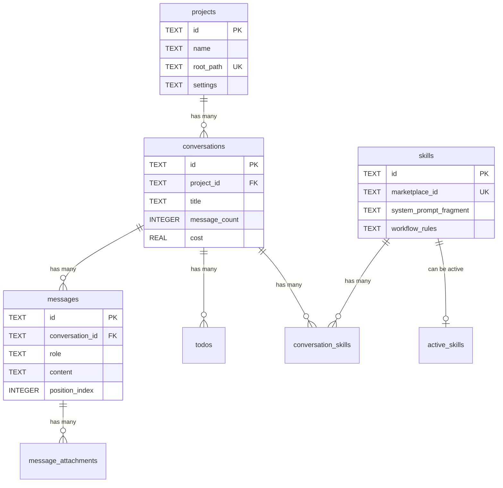
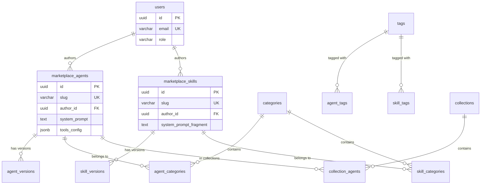

# TalkCody 数据库架构完整文档

> 文档版本: 1.0
> 最后更新: 2025-11-08
> 作者: Database Schema Analysis

## 目录
- [概述](#概述)
- [本地 SQLite 数据库](#本地-sqlite-数据库)
  - [1. Chat History Database (chat_history.db)](#1-chat-history-database)
  - [2. Agents Database (agents.db)](#2-agents-database)
  - [3. Settings Database (settings.db)](#3-settings-database)
- [远程 PostgreSQL 数据库](#远程-postgresql-数据库)
- [数据库关系图](#数据库关系图)

---

## 概述

TalkCody 使用混合数据库架构：
- **本地存储**: 3个独立的 SQLite 数据库
- **云端存储**: 1个 PostgreSQL 数据库（Neon）

### 数据库分布

| 数据库 | 类型 | 用途 | 表数量 |
|--------|------|------|--------|
| `chat_history.db` | SQLite | 会话、消息、项目管理 | 7 |
| `agents.db` | SQLite | AI代理和技能配置 | 3 |
| `settings.db` | SQLite | 应用设置 | 1 |
| Marketplace API | PostgreSQL | 云端市场服务 | 18 |
| **总计** | - | - | **29** |

---

## 本地 SQLite 数据库

### 1. Chat History Database

**文件**: `chat_history.db`
**定义位置**: `src/services/database/database-init.ts`

#### 1.1 表: `projects`

**用途**: 存储项目信息，用于组织和分类会话

```sql
CREATE TABLE IF NOT EXISTS projects (
    id TEXT PRIMARY KEY,                    -- 项目唯一标识符 (例: 'default', 'my-project')
    name TEXT NOT NULL,                     -- 项目显示名称
    description TEXT DEFAULT '',            -- 项目描述
    created_at INTEGER NOT NULL,            -- 创建时间戳 (Unix timestamp)
    updated_at INTEGER NOT NULL,            -- 更新时间戳
    context TEXT DEFAULT '',                -- 项目上下文信息
    rules TEXT DEFAULT '',                  -- 项目特定规则
    root_path TEXT DEFAULT NULL,            -- 仓库根路径 (唯一)
    settings TEXT DEFAULT NULL              -- 项目设置 (JSON字符串)
);

-- 索引
CREATE UNIQUE INDEX IF NOT EXISTS idx_projects_root_path
ON projects(root_path) WHERE root_path IS NOT NULL;
```

**字段说明**:

| 字段 | 类型 | 约束 | 说明 |
|------|------|------|------|
| `id` | TEXT | PRIMARY KEY | 项目ID，自定义字符串 |
| `name` | TEXT | NOT NULL | 项目名称，显示在UI中 |
| `description` | TEXT | DEFAULT '' | 项目描述信息 |
| `created_at` | INTEGER | NOT NULL | 创建时间，毫秒时间戳 |
| `updated_at` | INTEGER | NOT NULL | 最后更新时间 |
| `context` | TEXT | DEFAULT '' | 项目上下文，用于AI理解项目 |
| `rules` | TEXT | DEFAULT '' | 项目级别的规则和约束 |
| `root_path` | TEXT | UNIQUE | Git仓库根目录路径 |
| `settings` | TEXT | DEFAULT NULL | JSON格式的项目配置 |

**代码位置**: `src/services/database/database-init.ts:14-27`

---

#### 1.2 表: `conversations`

**用途**: 存储会话元数据和统计信息

```sql
CREATE TABLE IF NOT EXISTS conversations (
    id TEXT PRIMARY KEY,                    -- 会话唯一标识符
    title TEXT NOT NULL,                    -- 会话标题
    project_id TEXT NOT NULL DEFAULT 'default', -- 所属项目ID
    created_at INTEGER NOT NULL,            -- 创建时间戳
    updated_at INTEGER NOT NULL,            -- 更新时间戳
    message_count INTEGER DEFAULT 0,        -- 消息数量
    cost REAL DEFAULT 0,                    -- 总计费用 (美元)
    input_token INTEGER DEFAULT 0,          -- 总输入token数
    output_token INTEGER DEFAULT 0,         -- 总输出token数
    settings TEXT DEFAULT NULL,             -- 会话设置 (JSON)

    FOREIGN KEY (project_id) REFERENCES projects (id) ON DELETE CASCADE
);

-- 索引
CREATE INDEX IF NOT EXISTS idx_conversations_project_id ON conversations(project_id);
```

**字段说明**:

| 字段 | 类型 | 约束 | 说明 |
|------|------|------|------|
| `id` | TEXT | PRIMARY KEY | 会话唯一ID |
| `title` | TEXT | NOT NULL | 会话标题（自动生成或用户编辑） |
| `project_id` | TEXT | FK, DEFAULT 'default' | 关联的项目ID |
| `created_at` | INTEGER | NOT NULL | 创建时间戳 |
| `updated_at` | INTEGER | NOT NULL | 最后更新时间 |
| `message_count` | INTEGER | DEFAULT 0 | 统计消息数量 |
| `cost` | REAL | DEFAULT 0 | 累计API调用费用 |
| `input_token` | INTEGER | DEFAULT 0 | 累计输入token |
| `output_token` | INTEGER | DEFAULT 0 | 累计输出token |
| `settings` | TEXT | DEFAULT NULL | 会话级别配置（JSON） |

**注意**: `mode_count` 字段已移除（用户现在直接选择代理）

**代码位置**: `src/services/database/database-init.ts:29-40`

---

#### 1.3 表: `messages`

**用途**: 存储对话消息内容

```sql
CREATE TABLE IF NOT EXISTS messages (
    id TEXT PRIMARY KEY,                    -- 消息唯一标识符
    conversation_id TEXT NOT NULL,          -- 所属会话ID
    role TEXT NOT NULL,                     -- 角色: 'user' 或 'assistant'
    content TEXT NOT NULL,                  -- 消息内容
    timestamp INTEGER NOT NULL,             -- 消息时间戳
    assistant_id TEXT,                      -- 助手/代理ID
    position_index INTEGER DEFAULT 0,       -- 位置索引 (支持分支对话)

    FOREIGN KEY (conversation_id) REFERENCES conversations (id) ON DELETE CASCADE
);

-- 索引
CREATE INDEX IF NOT EXISTS idx_messages_conversation_id ON messages(conversation_id);
CREATE INDEX IF NOT EXISTS idx_messages_timestamp ON messages(timestamp);
```

**字段说明**:

| 字段 | 类型 | 约束 | 说明 |
|------|------|------|------|
| `id` | TEXT | PRIMARY KEY | 消息唯一ID |
| `conversation_id` | TEXT | FK, NOT NULL | 所属会话 |
| `role` | TEXT | NOT NULL | 'user'（用户）或 'assistant'（AI） |
| `content` | TEXT | NOT NULL | 消息文本内容 |
| `timestamp` | INTEGER | NOT NULL | 消息发送时间 |
| `assistant_id` | TEXT | NULL | 发送消息的AI代理ID |
| `position_index` | INTEGER | DEFAULT 0 | 用于支持对话分支/树形结构 |

**代码位置**: `src/services/database/database-init.ts:42-53`

---

#### 1.4 表: `message_attachments`

**用途**: 存储消息附件元数据

```sql
CREATE TABLE IF NOT EXISTS message_attachments (
    id TEXT PRIMARY KEY,                    -- 附件唯一标识符
    message_id TEXT NOT NULL,               -- 所属消息ID
    type TEXT NOT NULL,                     -- 附件类型: 'file', 'image' 等
    filename TEXT NOT NULL,                 -- 原始文件名
    file_path TEXT NOT NULL,                -- 存储路径
    mime_type TEXT NOT NULL,                -- MIME类型
    size INTEGER NOT NULL,                  -- 文件大小 (字节)
    created_at INTEGER NOT NULL,            -- 创建时间戳

    FOREIGN KEY (message_id) REFERENCES messages (id) ON DELETE CASCADE
);

-- 索引
CREATE INDEX IF NOT EXISTS idx_attachments_message_id ON message_attachments(message_id);
```

**字段说明**:

| 字段 | 类型 | 约束 | 说明 |
|------|------|------|------|
| `id` | TEXT | PRIMARY KEY | 附件唯一ID |
| `message_id` | TEXT | FK, NOT NULL | 关联的消息ID |
| `type` | TEXT | NOT NULL | 附件类型（file/image/video等） |
| `filename` | TEXT | NOT NULL | 原始文件名 |
| `file_path` | TEXT | NOT NULL | 本地存储路径 |
| `mime_type` | TEXT | NOT NULL | 文件MIME类型 |
| `size` | INTEGER | NOT NULL | 文件大小（字节） |
| `created_at` | INTEGER | NOT NULL | 上传时间 |

**代码位置**: `src/services/database/database-init.ts:55-66`

---

#### 1.5 表: `mcp_servers`

**用途**: Model Context Protocol (MCP) 服务器配置

```sql
CREATE TABLE IF NOT EXISTS mcp_servers (
    id TEXT PRIMARY KEY,                    -- MCP服务器ID
    name TEXT NOT NULL,                     -- 服务器名称
    url TEXT NOT NULL,                      -- 服务器URL (HTTP/SSE) 或空 (stdio)
    protocol TEXT NOT NULL CHECK (protocol IN ('http', 'sse', 'stdio')), -- 协议类型
    api_key TEXT DEFAULT NULL,              -- API密钥 (可选)
    headers TEXT DEFAULT '{}',              -- HTTP请求头 (JSON)
    stdio_command TEXT DEFAULT NULL,        -- stdio命令 (如: 'npx')
    stdio_args TEXT DEFAULT '[]',           -- stdio命令参数 (JSON数组)
    is_enabled BOOLEAN DEFAULT 1,           -- 是否启用
    is_built_in BOOLEAN DEFAULT 0,          -- 是否为内置服务器
    created_at INTEGER NOT NULL,            -- 创建时间
    updated_at INTEGER NOT NULL             -- 更新时间
);

-- 索引
CREATE INDEX IF NOT EXISTS idx_mcp_servers_is_enabled ON mcp_servers(is_enabled);
CREATE INDEX IF NOT EXISTS idx_mcp_servers_is_built_in ON mcp_servers(is_built_in);
CREATE INDEX IF NOT EXISTS idx_mcp_servers_protocol ON mcp_servers(protocol);
CREATE INDEX IF NOT EXISTS idx_mcp_servers_enabled_builtin ON mcp_servers(is_enabled, is_built_in);
```

**字段说明**:

| 字段 | 类型 | 约束 | 说明 |
|------|------|------|------|
| `id` | TEXT | PRIMARY KEY | 服务器唯一ID |
| `name` | TEXT | NOT NULL | 显示名称 |
| `url` | TEXT | NOT NULL | HTTP/SSE服务器URL |
| `protocol` | TEXT | CHECK | 'http', 'sse', 或 'stdio' |
| `api_key` | TEXT | NULL | 可选的API密钥 |
| `headers` | TEXT | DEFAULT '{}' | HTTP头（JSON字符串） |
| `stdio_command` | TEXT | NULL | stdio模式的命令 |
| `stdio_args` | TEXT | DEFAULT '[]' | 命令参数（JSON数组） |
| `is_enabled` | BOOLEAN | DEFAULT 1 | 是否启用 |
| `is_built_in` | BOOLEAN | DEFAULT 0 | 系统内置服务器 |
| `created_at` | INTEGER | NOT NULL | 创建时间 |
| `updated_at` | INTEGER | NOT NULL | 更新时间 |

**内置服务器**:
- Context7 (stdio)
- GitHub MCP Server (stdio)
- Chrome DevTools MCP (stdio)

**代码位置**: `src/services/database/database-init.ts:68-88`

---

#### 1.6 表: `todos`

**用途**: 会话任务管理

```sql
CREATE TABLE IF NOT EXISTS todos (
    id TEXT PRIMARY KEY,                    -- 任务ID
    conversation_id TEXT NOT NULL,          -- 所属会话ID
    content TEXT NOT NULL,                  -- 任务内容描述
    status TEXT NOT NULL CHECK (status IN ('pending', 'in_progress', 'completed')), -- 状态
    priority TEXT NOT NULL CHECK (priority IN ('high', 'medium', 'low')),          -- 优先级
    created_at INTEGER NOT NULL,            -- 创建时间
    updated_at INTEGER NOT NULL,            -- 更新时间

    FOREIGN KEY (conversation_id) REFERENCES conversations (id) ON DELETE CASCADE
);

-- 索引
CREATE INDEX IF NOT EXISTS idx_todos_conversation_id ON todos(conversation_id);
CREATE INDEX IF NOT EXISTS idx_todos_status ON todos(status);
CREATE INDEX IF NOT EXISTS idx_todos_created_at ON todos(created_at);
```

**字段说明**:

| 字段 | 类型 | 约束 | 说明 |
|------|------|------|------|
| `id` | TEXT | PRIMARY KEY | 任务唯一ID |
| `conversation_id` | TEXT | FK, NOT NULL | 关联的会话 |
| `content` | TEXT | NOT NULL | 任务描述 |
| `status` | TEXT | CHECK | pending/in_progress/completed |
| `priority` | TEXT | CHECK | high/medium/low |
| `created_at` | INTEGER | NOT NULL | 创建时间 |
| `updated_at` | INTEGER | NOT NULL | 更新时间 |

**代码位置**: `src/services/database/database-init.ts:90-101`

---

#### 1.7 表: `active_skills`

**用途**: 全局激活的技能列表

```sql
CREATE TABLE IF NOT EXISTS active_skills (
    skill_id TEXT PRIMARY KEY,              -- 技能ID
    created_at INTEGER NOT NULL             -- 激活时间
);

-- 索引
CREATE INDEX IF NOT EXISTS idx_active_skills_created_at ON active_skills(created_at);
```

**字段说明**:

| 字段 | 类型 | 约束 | 说明 |
|------|------|------|------|
| `skill_id` | TEXT | PRIMARY KEY | 技能唯一标识 |
| `created_at` | INTEGER | NOT NULL | 激活时间戳 |

**代码位置**: `src/services/database/database-init.ts:103-107`

---

### 2. Agents Database

**文件**: `agents.db`
**定义位置**: `src/services/database/agent-database-init.ts`

#### 2.1 表: `agents`

**用途**: AI代理配置和元数据

```sql
CREATE TABLE IF NOT EXISTS agents (
    id TEXT PRIMARY KEY,                    -- 代理唯一ID
    name TEXT NOT NULL,                     -- 代理名称
    description TEXT DEFAULT '',            -- 简短描述
    model TEXT NOT NULL,                    -- AI模型标识
    system_prompt TEXT NOT NULL,            -- 系统提示词
    tools_config TEXT DEFAULT '{}',         -- 工具配置 (JSON)
    rules TEXT DEFAULT '',                  -- 规则
    output_format TEXT DEFAULT '',          -- 输出格式要求
    is_hidden BOOLEAN DEFAULT 0,            -- 是否隐藏
    is_default BOOLEAN DEFAULT 0,           -- 是否为默认代理
    is_enabled BOOLEAN DEFAULT 1,           -- 是否启用

    -- 动态提示词功能
    dynamic_enabled BOOLEAN DEFAULT 0,      -- 启用动态提示词
    dynamic_providers TEXT DEFAULT '[]',    -- 动态提供者列表 (JSON数组)
    dynamic_variables TEXT DEFAULT '{}',    -- 动态变量 (JSON对象)
    dynamic_provider_settings TEXT DEFAULT '{}', -- 提供者设置 (JSON)

    -- 元数据
    created_at INTEGER NOT NULL,            -- 创建时间
    updated_at INTEGER NOT NULL,            -- 更新时间
    created_by TEXT DEFAULT 'system',       -- 创建者
    usage_count INTEGER DEFAULT 0,          -- 使用次数统计

    -- 市场相关字段
    source_type TEXT DEFAULT 'local',       -- 来源: 'local', 'system', 'marketplace'
    marketplace_id TEXT,                    -- 市场ID
    marketplace_version TEXT,               -- 市场版本
    forked_from_id TEXT,                    -- Fork来源ID
    forked_from_marketplace_id TEXT,        -- Fork市场来源
    is_shared INTEGER DEFAULT 0,            -- 是否分享到市场
    last_synced_at INTEGER,                 -- 最后同步时间

    -- 显示信息
    icon_url TEXT,                          -- 图标URL
    author_name TEXT,                       -- 作者名称
    author_id TEXT,                         -- 作者ID
    categories TEXT DEFAULT '[]',           -- 分类 (JSON数组)
    tags TEXT DEFAULT '[]',                 -- 标签 (JSON数组)

    -- 技能系统
    default_skills TEXT DEFAULT '[]'        -- 默认技能列表 (JSON数组)
);

-- 索引
CREATE INDEX IF NOT EXISTS idx_agents_is_hidden ON agents(is_hidden);
```

**字段分组说明**:

**核心配置字段**:
- `id`, `name`, `description`: 基本标识
- `model`: AI模型（如 'gpt-4', 'claude-3-opus'）
- `system_prompt`: 系统级提示词
- `tools_config`: 工具配置（JSON格式）
- `rules`, `output_format`: 行为约束

**状态字段**:
- `is_hidden`: UI中隐藏
- `is_default`: 系统默认代理
- `is_enabled`: 是否可用

**动态提示词字段**:
- `dynamic_enabled`: 开启动态提示词功能
- `dynamic_providers`: 使用的动态内容提供者
- `dynamic_variables`: 变量映射
- `dynamic_provider_settings`: 提供者配置

**市场集成字段**:
- `source_type`: 代理来源（本地/系统/市场）
- `marketplace_id`: 云端市场ID
- `marketplace_version`: 版本号
- `forked_from_*`: Fork关系追踪
- `is_shared`: 是否公开分享
- `last_synced_at`: 同步时间

**展示字段**:
- `icon_url`: 代理图标
- `author_name`, `author_id`: 作者信息
- `categories`, `tags`: 分类和标签

**技能系统**:
- `default_skills`: 代理默认激活的技能ID列表

**代码位置**: `src/services/database/agent-database-init.ts:10-54`

---

#### 2.2 表: `skills`

**用途**: 技能定义（可组合的代理能力）

```sql
CREATE TABLE IF NOT EXISTS skills (
    id TEXT PRIMARY KEY,                    -- 技能唯一ID
    name TEXT NOT NULL,                     -- 技能名称
    description TEXT,                       -- 简短描述
    long_description TEXT,                  -- 详细描述
    category TEXT NOT NULL,                 -- 分类
    icon_url TEXT,                          -- 图标URL

    -- 核心内容（三大组件）
    system_prompt_fragment TEXT,            -- 系统提示词片段
    workflow_rules TEXT,                    -- 工作流规则
    documentation TEXT,                     -- 使用文档

    -- 市场元数据
    marketplace_id TEXT,                    -- 市场ID
    marketplace_version TEXT,               -- 市场版本
    author_name TEXT,                       -- 作者名称
    author_id TEXT,                         -- 作者ID
    downloads INTEGER DEFAULT 0,            -- 下载量
    rating REAL DEFAULT 0,                  -- 评分
    last_synced_at INTEGER,                 -- 最后同步时间

    -- 本地元数据
    is_built_in INTEGER DEFAULT 0,          -- 内置技能
    tags TEXT DEFAULT '[]',                 -- 标签 (JSON数组)
    created_at INTEGER NOT NULL,            -- 创建时间
    updated_at INTEGER NOT NULL,            -- 更新时间
    last_used_at INTEGER,                   -- 最后使用时间

    UNIQUE(marketplace_id)
);

-- 索引
CREATE INDEX IF NOT EXISTS idx_skills_category ON skills(category);
CREATE INDEX IF NOT EXISTS idx_skills_marketplace ON skills(marketplace_id);
CREATE INDEX IF NOT EXISTS idx_skills_tags ON skills(tags);
CREATE INDEX IF NOT EXISTS idx_skills_name ON skills(name);
```

**字段说明**:

**基本信息**:
- `id`: 本地唯一ID
- `name`: 技能名称
- `description`: 简短描述（1-2句）
- `long_description`: 详细说明
- `category`: 分类（如 'code-review', 'testing'）
- `icon_url`: 显示图标

**核心内容**（三大组件）:
- `system_prompt_fragment`: 注入到系统提示词的内容
- `workflow_rules`: 工作流程和规则
- `documentation`: 使用文档和示例

**市场字段**:
- `marketplace_id`: 云端唯一ID
- `marketplace_version`: 版本号
- `author_name`, `author_id`: 作者信息
- `downloads`: 下载统计
- `rating`: 用户评分
- `last_synced_at`: 同步时间戳

**本地字段**:
- `is_built_in`: 系统内置技能标记
- `tags`: 标签数组（JSON）
- `created_at`, `updated_at`: 时间戳
- `last_used_at`: 使用统计

**代码位置**: `src/services/database/migrations/add-skills-tables.ts:10-43`

---

#### 2.3 表: `conversation_skills`

**用途**: 会话级别激活的技能

```sql
CREATE TABLE IF NOT EXISTS conversation_skills (
    conversation_id TEXT NOT NULL,          -- 会话ID
    skill_id TEXT NOT NULL,                 -- 技能ID
    enabled INTEGER DEFAULT 1,              -- 是否启用
    priority INTEGER DEFAULT 0,             -- 优先级
    activated_at INTEGER NOT NULL,          -- 激活时间

    FOREIGN KEY (conversation_id) REFERENCES conversations(id) ON DELETE CASCADE,
    FOREIGN KEY (skill_id) REFERENCES skills(id) ON DELETE CASCADE,

    PRIMARY KEY (conversation_id, skill_id)
);

-- 索引
CREATE INDEX IF NOT EXISTS idx_conversation_skills_conversation
ON conversation_skills(conversation_id);

CREATE INDEX IF NOT EXISTS idx_conversation_skills_enabled
ON conversation_skills(conversation_id, enabled);

CREATE INDEX IF NOT EXISTS idx_conversation_skills_priority
ON conversation_skills(conversation_id, priority DESC);
```

**字段说明**:

| 字段 | 类型 | 约束 | 说明 |
|------|------|------|------|
| `conversation_id` | TEXT | PK, FK | 会话ID |
| `skill_id` | TEXT | PK, FK | 技能ID |
| `enabled` | INTEGER | DEFAULT 1 | 是否启用 |
| `priority` | INTEGER | DEFAULT 0 | 执行优先级（越大越先） |
| `activated_at` | INTEGER | NOT NULL | 激活时间 |

**用途**: 为特定会话启用/禁用技能，支持优先级排序

**代码位置**: `src/services/database/migrations/add-skills-tables.ts:45-70`

---

### 3. Settings Database

**文件**: `settings.db`
**定义位置**: `src/lib/settings-store.ts`

#### 3.1 表: `settings`

**用途**: 键值存储应用配置

```sql
CREATE TABLE IF NOT EXISTS settings (
    key TEXT PRIMARY KEY,                   -- 配置键
    value TEXT NOT NULL                     -- 配置值 (JSON或字符串)
);
```

**字段说明**:

| 字段 | 类型 | 约束 | 说明 |
|------|------|------|------|
| `key` | TEXT | PRIMARY KEY | 配置键（唯一） |
| `value` | TEXT | NOT NULL | 配置值（JSON字符串或纯文本） |

**默认配置项**:

| Key | 默认值 | 说明 |
|-----|--------|------|
| `theme` | 'system' | 主题模式 |
| `language` | 'en' | 语言设置 |
| `model` | GPT_41_NANO | 默认AI模型 |
| `assistantId` | 'coding' | 默认助手ID |
| `is_think` | 'false' | 思考模式 |
| `project` | 'default' | 当前项目 |
| `current_conversationid` | '' | 当前会话ID |
| `current_root_path` | '' | 当前仓库路径 |
| `ai_completion_enabled` | 'false' | AI补全 |
| `get_context_tool_model` | GROK_CODE_FAST | 上下文工具模型 |
| `api_key_*` | - | 各AI提供商API密钥 |
| `shortcut_*` | - | 快捷键配置（JSON） |

**代码位置**: `src/lib/settings-store.ts:71-76`

---

## 远程 PostgreSQL 数据库

**平台**: Neon (Serverless PostgreSQL)
**定义位置**: `apps/api/src/db/schema.ts`
**迁移文件**: `apps/api/src/db/migrations/`

### 数据库架构

#### 3.1 表: `users`

**用途**: 用户账户管理

```sql
CREATE TABLE "users" (
    id uuid PRIMARY KEY DEFAULT gen_random_uuid() NOT NULL,
    email varchar(255) NOT NULL,
    name varchar(255) NOT NULL,
    avatar_url text,
    role varchar(20) DEFAULT 'user' NOT NULL,  -- 'user' | 'admin'
    bio text,
    website text,

    -- OAuth集成
    github_id varchar(255),
    google_id varchar(255),

    -- 状态
    is_verified boolean DEFAULT false NOT NULL,
    last_login_at timestamp,

    created_at timestamp DEFAULT now() NOT NULL,
    updated_at timestamp DEFAULT now() NOT NULL,

    CONSTRAINT users_email_unique UNIQUE(email)
);

-- 索引
CREATE INDEX users_email_idx ON users(email);
CREATE INDEX users_github_idx ON users(github_id);
CREATE INDEX users_google_idx ON users(google_id);
```

**字段说明**:

| 字段 | 类型 | 说明 |
|------|------|------|
| `id` | uuid | 用户唯一ID |
| `email` | varchar(255) | 邮箱（唯一） |
| `name` | varchar(255) | 显示名称 |
| `avatar_url` | text | 头像URL |
| `role` | varchar(20) | 角色（user/admin） |
| `bio` | text | 个人简介 |
| `website` | text | 个人网站 |
| `github_id` | varchar(255) | GitHub OAuth ID |
| `google_id` | varchar(255) | Google OAuth ID |
| `is_verified` | boolean | 邮箱验证状态 |
| `last_login_at` | timestamp | 最后登录时间 |
| `created_at` | timestamp | 创建时间 |
| `updated_at` | timestamp | 更新时间 |

---

#### 3.2 表: `marketplace_agents`

**用途**: 市场发布的AI代理

```sql
CREATE TABLE "marketplace_agents" (
    id uuid PRIMARY KEY DEFAULT gen_random_uuid() NOT NULL,
    slug varchar(100) NOT NULL UNIQUE,
    name varchar(255) NOT NULL,
    description text NOT NULL,
    long_description text,
    author_id uuid NOT NULL REFERENCES users(id) ON DELETE CASCADE,

    -- 代理配置（最新版本）
    model varchar(100) NOT NULL,
    system_prompt text NOT NULL,
    tools_config jsonb DEFAULT '{}'::jsonb NOT NULL,
    rules text,
    output_format text,
    dynamic_prompt_config jsonb,

    icon_url text,
    banner_url text,

    -- 统计数据
    download_count integer DEFAULT 0 NOT NULL,
    install_count integer DEFAULT 0 NOT NULL,
    usage_count integer DEFAULT 0 NOT NULL,
    rating integer DEFAULT 0 NOT NULL,
    rating_count integer DEFAULT 0 NOT NULL,

    -- 状态
    is_featured boolean DEFAULT false NOT NULL,
    is_published boolean DEFAULT false NOT NULL,
    published_at timestamp,

    latest_version varchar(50) NOT NULL,

    -- 全文搜索
    search_vector text,

    created_at timestamp DEFAULT now() NOT NULL,
    updated_at timestamp DEFAULT now() NOT NULL
);

-- 索引
CREATE INDEX agents_slug_idx ON marketplace_agents(slug);
CREATE INDEX agents_author_idx ON marketplace_agents(author_id);
CREATE INDEX agents_featured_idx ON marketplace_agents(is_featured);
CREATE INDEX agents_downloads_idx ON marketplace_agents(download_count);
CREATE INDEX agents_created_idx ON marketplace_agents(created_at);
CREATE INDEX agents_published_idx ON marketplace_agents(is_published);
```

**字段分组**:

**基本信息**:
- `id`, `slug`, `name`, `description`
- `author_id`: 关联到users表

**代理配置**（存储最新版本）:
- `model`, `system_prompt`, `tools_config`
- `rules`, `output_format`
- `dynamic_prompt_config`: 动态提示词配置

**展示素材**:
- `icon_url`, `banner_url`

**统计数据**:
- `download_count`: 下载次数
- `install_count`: 安装次数
- `usage_count`: 使用次数
- `rating`, `rating_count`: 评分

**发布状态**:
- `is_featured`: 精选推荐
- `is_published`: 已发布
- `published_at`: 发布时间
- `latest_version`: 最新版本号

---

#### 3.3 表: `agent_versions`

**用途**: 代理版本历史

```sql
CREATE TABLE "agent_versions" (
    id uuid PRIMARY KEY DEFAULT gen_random_uuid() NOT NULL,
    agent_id uuid NOT NULL REFERENCES marketplace_agents(id) ON DELETE CASCADE,
    version varchar(50) NOT NULL,

    -- 代理定义
    system_prompt text NOT NULL,
    tools_config jsonb DEFAULT '{}'::jsonb NOT NULL,
    rules text,
    output_format text,
    dynamic_prompt_config jsonb,

    change_log text,
    is_prerelease boolean DEFAULT false NOT NULL,

    created_at timestamp DEFAULT now() NOT NULL,

    CONSTRAINT versions_unique UNIQUE(agent_id, version)
);

-- 索引
CREATE INDEX versions_agent_idx ON agent_versions(agent_id);
CREATE INDEX versions_created_idx ON agent_versions(created_at);
```

**字段说明**:
- `agent_id`: 关联到marketplace_agents
- `version`: 语义化版本号（如 '1.2.0'）
- `change_log`: 更新日志
- `is_prerelease`: 预发布版本标记

---

#### 3.4 表: `marketplace_skills`

**用途**: 市场发布的技能

```sql
CREATE TABLE "marketplace_skills" (
    id uuid PRIMARY KEY DEFAULT gen_random_uuid() NOT NULL,
    slug varchar(100) NOT NULL UNIQUE,
    name varchar(255) NOT NULL,
    description text NOT NULL,
    long_description text,
    author_id uuid NOT NULL REFERENCES users(id) ON DELETE CASCADE,

    -- 技能内容（最新版本）
    system_prompt_fragment text,
    workflow_rules text,
    documentation jsonb DEFAULT '[]'::jsonb NOT NULL,

    icon_url text,
    banner_url text,

    -- 统计数据
    download_count integer DEFAULT 0 NOT NULL,
    install_count integer DEFAULT 0 NOT NULL,
    usage_count integer DEFAULT 0 NOT NULL,
    rating integer DEFAULT 0 NOT NULL,
    rating_count integer DEFAULT 0 NOT NULL,

    -- 状态
    is_featured boolean DEFAULT false NOT NULL,
    is_published boolean DEFAULT false NOT NULL,
    published_at timestamp,

    latest_version varchar(50) NOT NULL,

    -- 全文搜索
    search_vector text,

    created_at timestamp DEFAULT now() NOT NULL,
    updated_at timestamp DEFAULT now() NOT NULL
);

-- 索引
CREATE INDEX skills_slug_idx ON marketplace_skills(slug);
CREATE INDEX skills_author_idx ON marketplace_skills(author_id);
CREATE INDEX skills_featured_idx ON marketplace_skills(is_featured);
CREATE INDEX skills_downloads_idx ON marketplace_skills(download_count);
CREATE INDEX skills_created_idx ON marketplace_skills(created_at);
CREATE INDEX skills_published_idx ON marketplace_skills(is_published);
```

**字段说明**: 结构类似marketplace_agents，但内容为技能定义

---

#### 3.5 表: `skill_versions`

**用途**: 技能版本历史

```sql
CREATE TABLE "skill_versions" (
    id uuid PRIMARY KEY DEFAULT gen_random_uuid() NOT NULL,
    skill_id uuid NOT NULL REFERENCES marketplace_skills(id) ON DELETE CASCADE,
    version varchar(50) NOT NULL,

    -- 技能内容
    system_prompt_fragment text,
    workflow_rules text,
    documentation jsonb DEFAULT '[]'::jsonb NOT NULL,

    change_log text,
    is_prerelease boolean DEFAULT false NOT NULL,

    created_at timestamp DEFAULT now() NOT NULL,

    CONSTRAINT skill_versions_unique UNIQUE(skill_id, version)
);

-- 索引
CREATE INDEX skill_versions_skill_idx ON skill_versions(skill_id);
CREATE INDEX skill_versions_created_idx ON skill_versions(created_at);
```

---

#### 3.6 表: `categories`

**用途**: 分类管理

```sql
CREATE TABLE "categories" (
    id uuid PRIMARY KEY DEFAULT gen_random_uuid() NOT NULL,
    name varchar(100) NOT NULL UNIQUE,
    slug varchar(100) NOT NULL UNIQUE,
    description text,
    icon varchar(50),
    display_order integer DEFAULT 0 NOT NULL,
    created_at timestamp DEFAULT now() NOT NULL
);

-- 索引
CREATE INDEX categories_slug_idx ON categories(slug);
CREATE INDEX categories_order_idx ON categories(display_order);
```

---

#### 3.7 表: `tags`

**用途**: 标签管理

```sql
CREATE TABLE "tags" (
    id uuid PRIMARY KEY DEFAULT gen_random_uuid() NOT NULL,
    name varchar(50) NOT NULL UNIQUE,
    slug varchar(50) NOT NULL UNIQUE,
    usage_count integer DEFAULT 0 NOT NULL,
    created_at timestamp DEFAULT now() NOT NULL
);

-- 索引
CREATE INDEX tags_slug_idx ON tags(slug);
CREATE INDEX tags_usage_idx ON tags(usage_count);
```

---

#### 3.8 关联表（Junction Tables）

**agent_categories**: 代理-分类关联
```sql
CREATE TABLE "agent_categories" (
    agent_id uuid NOT NULL REFERENCES marketplace_agents(id) ON DELETE CASCADE,
    category_id uuid NOT NULL REFERENCES categories(id) ON DELETE CASCADE,
    CONSTRAINT agent_categories_pk UNIQUE(agent_id, category_id)
);
```

**agent_tags**: 代理-标签关联
```sql
CREATE TABLE "agent_tags" (
    agent_id uuid NOT NULL REFERENCES marketplace_agents(id) ON DELETE CASCADE,
    tag_id uuid NOT NULL REFERENCES tags(id) ON DELETE CASCADE,
    CONSTRAINT agent_tags_pk UNIQUE(agent_id, tag_id)
);
```

**skill_categories**: 技能-分类关联
```sql
CREATE TABLE "skill_categories" (
    skill_id uuid NOT NULL REFERENCES marketplace_skills(id) ON DELETE CASCADE,
    category_id uuid NOT NULL REFERENCES categories(id) ON DELETE CASCADE,
    CONSTRAINT skill_categories_pk UNIQUE(skill_id, category_id)
);
```

**skill_tags**: 技能-标签关联
```sql
CREATE TABLE "skill_tags" (
    skill_id uuid NOT NULL REFERENCES marketplace_skills(id) ON DELETE CASCADE,
    tag_id uuid NOT NULL REFERENCES tags(id) ON DELETE CASCADE,
    CONSTRAINT skill_tags_pk UNIQUE(skill_id, tag_id)
);
```

---

#### 3.9 表: `collections`

**用途**: 精选合集

```sql
CREATE TABLE "collections" (
    id uuid PRIMARY KEY DEFAULT gen_random_uuid() NOT NULL,
    name varchar(255) NOT NULL,
    slug varchar(100) NOT NULL UNIQUE,
    description text,
    icon varchar(50),
    is_featured boolean DEFAULT false NOT NULL,
    display_order integer DEFAULT 0 NOT NULL,
    created_at timestamp DEFAULT now() NOT NULL,
    updated_at timestamp DEFAULT now() NOT NULL
);

-- 索引
CREATE INDEX collections_slug_idx ON collections(slug);
CREATE INDEX collections_featured_idx ON collections(is_featured);
CREATE INDEX collections_order_idx ON collections(display_order);
```

**collection_agents**: 合集-代理关联
```sql
CREATE TABLE "collection_agents" (
    collection_id uuid NOT NULL REFERENCES collections(id) ON DELETE CASCADE,
    agent_id uuid NOT NULL REFERENCES marketplace_agents(id) ON DELETE CASCADE,
    display_order integer DEFAULT 0 NOT NULL,
    CONSTRAINT collection_agents_pk UNIQUE(collection_id, agent_id)
);
```

---

#### 3.10 统计表

**agent_stats**: 代理使用统计
```sql
CREATE TABLE "agent_stats" (
    id uuid PRIMARY KEY DEFAULT gen_random_uuid() NOT NULL,
    agent_id uuid NOT NULL REFERENCES marketplace_agents(id) ON DELETE CASCADE,
    version varchar(50),
    event_type varchar(20) NOT NULL,  -- 'download' | 'install' | 'usage'
    user_id uuid REFERENCES users(id) ON DELETE SET NULL,
    device_id varchar(255),
    created_at timestamp DEFAULT now() NOT NULL
);

-- 索引
CREATE INDEX stats_agent_idx ON agent_stats(agent_id);
CREATE INDEX stats_date_idx ON agent_stats(created_at);
CREATE INDEX stats_event_idx ON agent_stats(event_type);
CREATE INDEX stats_user_idx ON agent_stats(user_id);
```

**skill_stats**: 技能使用统计
```sql
CREATE TABLE "skill_stats" (
    id uuid PRIMARY KEY DEFAULT gen_random_uuid() NOT NULL,
    skill_id uuid NOT NULL REFERENCES marketplace_skills(id) ON DELETE CASCADE,
    version varchar(50),
    event_type varchar(20) NOT NULL,  -- 'download' | 'install' | 'usage'
    user_id uuid REFERENCES users(id) ON DELETE SET NULL,
    device_id varchar(255),
    created_at timestamp DEFAULT now() NOT NULL
);

-- 索引
CREATE INDEX skill_stats_skill_idx ON skill_stats(skill_id);
CREATE INDEX skill_stats_date_idx ON skill_stats(created_at);
CREATE INDEX skill_stats_event_idx ON skill_stats(event_type);
CREATE INDEX skill_stats_user_idx ON skill_stats(user_id);
```

---

## 数据库关系图

### 本地数据库关系



### 远程数据库关系



---

## 数据迁移记录

### 本地数据库迁移

1. **初始化** (`database-init.ts`)
   - 创建所有基础表
   - 插入默认项目 'default'
   - 初始化3个内置MCP服务器

2. **技能系统** (`add-skills-tables.ts`)
   - 添加 `skills` 表
   - 添加 `conversation_skills` 表

3. **市场字段** (`add-marketplace-fields.ts`)
   - 向 `agents` 表添加市场相关字段
   - 添加同步和Fork相关字段

4. **默认技能** (`add-agent-default-skills.ts`)
   - 向 `agents` 表添加 `default_skills` 字段

5. **动态升级** (`upgradeDatabase`)
   - 检测缺失列并自动添加
   - 向 `conversations` 和 `projects` 添加 `settings` 字段

### 远程数据库迁移

1. **初始迁移** (`0000_damp_retro_girl.sql`)
   - 创建所有基础表
   - 设置索引和外键

2. **补充字段** (`0001_add_missing_columns.sql`)
   - 添加遗漏的列

---

## 附录

### A. 数据类型映射

| SQLite类型 | PostgreSQL类型 | 说明 |
|-----------|---------------|------|
| TEXT | varchar/text | 字符串 |
| INTEGER | integer/bigint | 整数 |
| REAL | real/numeric | 浮点数 |
| BOOLEAN | boolean | 布尔值 |
| - | uuid | UUID（仅PG） |
| TEXT (JSON) | jsonb | JSON数据 |

### B. 时间戳格式

- **本地SQLite**: Unix时间戳（毫秒）INTEGER类型
- **远程PostgreSQL**: ISO 8601 timestamp类型

### C. JSON字段约定

所有JSON字段使用字符串存储（SQLite）或jsonb类型（PostgreSQL）：
- `tools_config`: `{"tool_name": {...}}`
- `settings`: `{"key": "value"}`
- `categories`: `["cat1", "cat2"]`
- `tags`: `["tag1", "tag2"]`

---

**文档结束**
